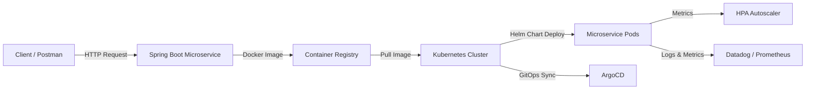

# Microservice K8s Demo

A production‑style **cloud‑native microservice** built with Spring Boot, packaged as a Docker image, deployed to Kubernetes using Helm charts, and delivered through a GitHub Actions CI/CD pipeline.  
This project demonstrates modern engineering practices including containerization, declarative infrastructure, autoscaling, GitOps (ArgoCD), and observability.

---

## 📌 Overview

This project showcases a complete microservice lifecycle:

- **Spring Boot microservice** with REST API  
- **Docker image build** and local run  
- **Kubernetes deployment** using Helm  
- **GitHub Actions CI/CD** pipeline  
- **ArgoCD GitOps workflow** (optional)  
- **Horizontal Pod Autoscaling (HPA)**  
- **Node/instance configuration**  
- **Observability using Datadog or Prometheus/Grafana**  
- **Local development using Minikube or Kind**  

The goal is to demonstrate **end‑to‑end cloud-native engineering** in a way that is fully free to run locally.

---

## 🎯 Goals of This Project

This demo highlights your ability to design and implement:

- Microservice architecture  
- Containerization & Docker best practices  
- Kubernetes deployment patterns  
- Helm chart packaging  
- GitHub Actions CI/CD pipelines  
- GitOps workflows (ArgoCD)  
- Autoscaling strategies  
- Observability & monitoring  
- Local cloud-native development  

---

## 🏗️ Architecture

### System Overview



## Dependencies

### Runtime and build dependencies

- Java 17 or newer
- Maven 3.9 or newer
- Spring Boot 3.4.5
- Spring Web for the REST API
- Spring Boot Actuator for health checks and application information
- Micrometer Prometheus Registry for Prometheus-compatible metrics
- Spring Boot Test and JUnit for automated tests

### Container and Kubernetes tools

- Docker Desktop or another Docker Engine
- `kubectl`
- Helm 3
- Minikube or Kind for a local Kubernetes cluster
- Metrics Server for HPA metrics when running Kubernetes locally

## Run Locally

### Run with Maven

From the repository root, run the tests and start the application:

```bash
mvn test
mvn spring-boot:run
```

The service listens on port `8080` by default. Change it with the
`SERVER_PORT` environment variable.

Call the greeting endpoint from another terminal:

```bash
curl "http://localhost:8080/api/v1/greetings?name=Kubernetes"
```

Health and metrics endpoints are also available:

```text
http://localhost:8080/actuator/health
http://localhost:8080/actuator/health/readiness
http://localhost:8080/actuator/health/liveness
http://localhost:8080/actuator/prometheus
```

### Run with Docker

Build and run the image:

```bash
docker build --tag microservice-k8s-demo:local .
docker run --rm --publish 8080:8080 microservice-k8s-demo:local
```

The same build can be run with the helper script:

```bash
./scripts/build.sh
```

On Windows, use Git Bash for the `.sh` scripts or run the equivalent Docker
and Maven commands in PowerShell.

## Deploy to Local Kubernetes

Start Minikube or Kind, then make the locally built image available to the
cluster. For Minikube:

```bash
minikube start
minikube image load microservice-k8s-demo:local
```

Apply the namespace and install the Helm release:

```bash
kubectl apply --filename k8s/namespace.yaml
helm upgrade --install microservice-demo helm \
    --namespace microservice-demo \
    --set image.repository=microservice-k8s-demo \
    --set image.tag=local \
    --set image.pullPolicy=IfNotPresent \
    --wait
```

Alternatively, use the deployment script after building the image:

```bash
./scripts/deploy.sh
```

Check the rollout and access the service through a local port-forward:

```bash
kubectl get pods --namespace microservice-demo
./scripts/port-forward.sh
curl "http://localhost:8080/api/v1/greetings?name=Kubernetes"
```

The HPA requires Metrics Server. On Minikube, enable it with:

```bash
minikube addons enable metrics-server
```

The standalone ingress manifest expects an NGINX Ingress Controller and the
hostname `microservice.local`. Port-forwarding is the simplest local access
method when an ingress controller is not installed.

## Useful Commands

```bash
# Validate the Helm chart
helm lint helm

# Render Kubernetes manifests without installing them
helm template microservice-demo helm --namespace microservice-demo

# View deployment status
kubectl rollout status deployment/microservice-demo-microservice-k8s-demo \
    --namespace microservice-demo
```

## Project Structure

```text
src/main/java/com/example/demo/   Spring Boot application and REST controller
src/main/resources/                Application configuration
helm/                              Helm chart for Deployment, Service, and HPA
k8s/                               Namespace and standalone ingress resources
scripts/                           Local build, deploy, and port-forward helpers
.github/workflows/                 GitHub Actions CI/CD workflow
```
