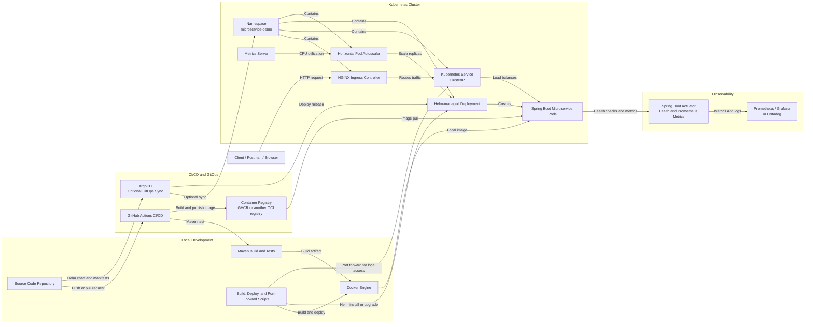

# Microservice K8s Demo Context Diagram

This diagram shows the application, delivery pipeline, Kubernetes runtime, and supporting platform components.

## Component Responsibilities

| Component | Responsibility |
| --- | --- |
| Client | Sends requests to the REST API. |
| Spring Boot Microservice | Handles `/api/v1/greetings` requests and exposes Actuator endpoints. |
| Docker Engine | Builds and runs the application container locally. |
| GitHub Actions | Runs tests, builds the image, publishes it, and validates the Helm chart. |
| Container Registry | Stores images for Kubernetes to pull. |
| NGINX Ingress | Provides external HTTP routing into the cluster. |
| Kubernetes Service | Provides stable internal networking and load balancing for pods. |
| Helm Deployment | Defines the application pods, probes, resources, and image configuration. |
| HPA | Adjusts pod replicas based on CPU utilization. |
| Metrics Server | Supplies resource metrics used by the HPA. |
| Actuator | Provides health, readiness, liveness, and Prometheus metrics endpoints. |
| Prometheus/Grafana or Datadog | Collects and visualizes application and infrastructure telemetry. |
| ArgoCD | Optionally synchronizes Kubernetes resources from Git. |
